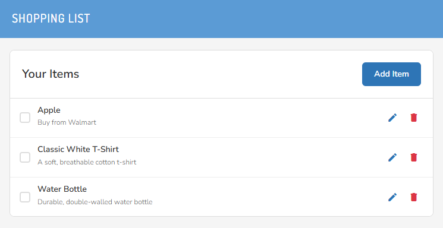

# Shopping List Application

A full-stack shopping list application built with React frontend and Node.js backend, using PostgreSQL database.

## 🏗️ Architecture

- **Frontend**: React with Redux Toolkit & Redux Saga
- **Backend**: Node.js with Express
- **Database**: PostgreSQL
- **Styling**: SCSS with BEM methodology
- **Containerization**: Docker & Docker Compose

## 📸 Screenshot



## 🚀 Quick Start with Docker (Recommended)

### Prerequisites
- Docker Desktop installed
- Git

### Setup
1. Clone the repository:
```bash
git clone https://github.com/raymondl5490/shopping.git
cd shopping
```

2. Start the application:
```bash
docker-compose up --build
```

3. Access the application:
- **Frontend**: http://localhost:3000
- **Backend API**: http://localhost:3001
- **Database**: localhost:5432

## 🛠️ Manual Setup (Non-Docker)

### Prerequisites
- Node.js 22+
- PostgreSQL 16+
- yarn

### Backend Setup
1. Navigate to backend directory:
```bash
cd backend
```

2. Install dependencies:
```bash
yarn
```

3. Set up environment variables:
```bash
# Create .env file
DB_HOST=localhost
DB_PORT=5432
DB_NAME=shopping
DB_USER=postgres
DB_PASSWORD=password
PORT=3001
NODE_ENV=development
```

4. Set up PostgreSQL database:
```sql
-- Create database
CREATE DATABASE shopping;
-- Run any migration scripts if available
```

5. Start backend server:
```bash
yarn dev
```

### Frontend Setup
1. Navigate to frontend directory:
```bash
cd frontend
```

2. Install dependencies:
```bash
yarn
```

3. Set up environment variables:
```bash
# Create .env.local file
REACT_APP_API_URL=http://localhost:3001/api
```

4. Start frontend development server:
```bash
yarn start
```

### Access Points
- **Frontend**: http://localhost:3000
- **Backend API**: http://localhost:3001/api
- **Database**: Configure your PostgreSQL connection

## 🔧 Available Scripts

### Frontend
- `yarn start` - Start development server
- `yarn build` - Build for production
- `yarn test` - Run tests

### Backend
- `yarn dev` - Start development server with nodemon
- `yarn start` - Start production server
- `yarn test` - Run tests

## 🌟 Features

- ✅ Add, edit, delete shopping items
- ✅ Mark items as purchased/unpurchased
- ✅ Responsive design
- ✅ Real-time state management with Redux
- ✅ RESTful API backend
- ✅ PostgreSQL data persistence
- ✅ Docker containerization
